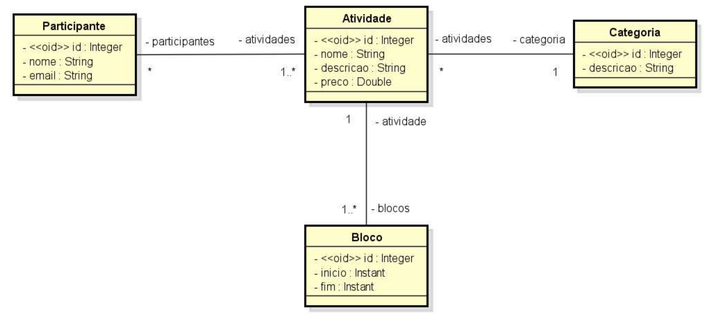
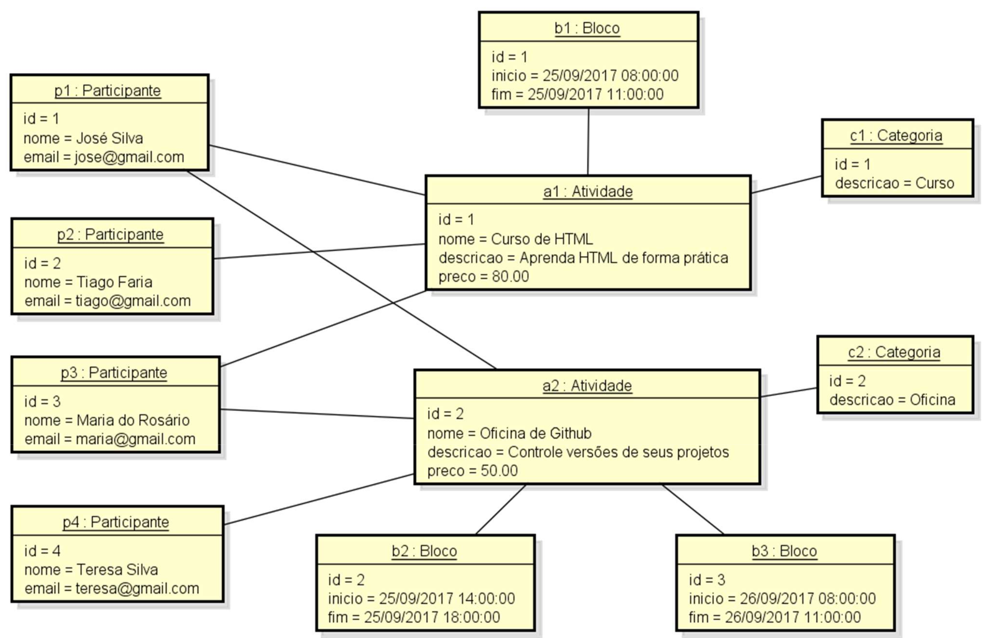

# Modelo de Domínio ORM
Este é um projeto desenvolvido em Java utilizando Spring Boot e o banco de dados H2. Ele implementa um modelo conceitual para gerenciar informações de participantes das atividades de um evento acadêmico.

## Especificação do Sistema
O sistema EVENTO permite gerenciar informações dos participantes das atividades de um evento acadêmico. Cada atividade possui nome, descrição, preço e pode ser dividida em vários blocos de horários. Cada participante é cadastrado com nome e email.

## Funcionalidades Implementadas
- Cadastro de atividades do evento
- Cadastro de participantes
- Divisão das atividades em blocos de horários
- Seeding da base de dados com dados de exemplo
- Diagrama UML do Modelo Conceitual

## Seeding da Base de Dados

## Executando o Projeto Localmente
1. Clone este repositório:

`git clone https://github.com/seu-usuario/modelo-dominio-orm.git`

2. Navegue até o diretório do projeto:

`cd modelo-dominio-orm`

3. Execute o projeto usando Maven:

`mvn spring-boot:run`

4. Abra o H2 Console em seu navegador:

http://localhost:8080/h2-console
(Obs: Certifique-se de que o aplicativo está em execução e a configuração do H2 está correta.)

## Faça login no H2 Console com as seguintes credenciais:
- Driver Class: org.h2.Driver
- JDBC URL: jdbc:h2:mem:testdb
- User Name: sa
- Password: (deixe em branco)
